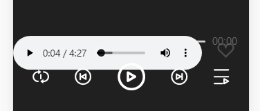
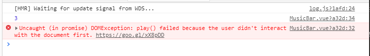

*概要：Chrome测试Vue音乐小项目出现的坑*

<!--more-->

# 1.audio元素

*Chrome等浏览器禁止音频自动播放以及操作Dom元素播放。*

使用Vue制作类网易云音乐单页面应用，准备使用隐藏audio元素，使用自己封装的音乐控件来获取并控制该audio元素的方法实现音乐控制的功能，但在引入单个audio的src测试时就出现了问题。

首先是为了测试，为了方便查看效果，我将audio元素添加autoplay以实现自动播放，结果是失败，几乎不生效偶尔有效，我为元素添加上controls，发现直接点击控制器的播放按钮是可以正常播放音乐的。

好，既然自带属性无效，那我直接获取元素对象操作它的play()，在该模块mounted阶段执行play()（通过vuex状态中的全局音乐是否播放的表示变量判断是否执行）。废话不多时，代码敲上，好家伙直接报错。如图。

这意思是不让我操作audio的dom元素的play()方法？完，我自定义控件能控制audio就是靠这些audio对象的方法，这样还咋搞？我赶紧面向百度编程，惊喜的是，还真给我找到了原因和解决方法！:open_mouth:

### 原因：

在新版Chrome浏览器（包括所有与Chrome使用相同内核的浏览器）中，已经不在允许自动播放音频和视频，设置了autoplay属性也一样不行。显示调用play()方法就如我之前的那样报错，这是因为，Chrome只允许用户对网页进行主动触发后才可自动播放音频和视频。严格地来说，是Chrome不允许在用户对网页进行触发之前播放音频，而视频其实是不受限制的。但因为视频文件同样包含了音频，所以也一同被禁止了。Chrome这样做的目的是为了防止开发者滥用自动播放功能而对用户产生骚扰。:expressionless:

该问题原因发现于该[博文](https://www.mzwu.com/article.asp?id=4411)。

### 解决方法：

Chrome设置的是在用户没有对主页进行主动触发之前无法自动播放及调用播放，首先是诱导点击，提示用户点击操作后方可播放，使用添加allow="autoplay"属性的iframe。怎么说，这是官方的解决方法，有点膈应人，目前没想到更好的方法，待更新。。。:interrobang:

### 题外话：

想了好久，发现自己的小项目可以确保播放音乐之前肯定是有交互操作的，需要先添加交互操作，行吧，那没什么问题了。待我想到避开Chrome禁止音频自动播放的好方法。该问题先记录，待更新。。。:interrobang: