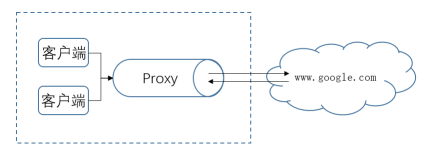
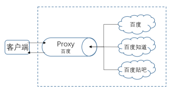

*概要：正向代理与反向代理的简述和区别......*

<!--more-->

### 简述：

#### 	一、代理的概念：

类似于一个中介，在A和B的连接中间使用C作为中介，C就是一个代理，用于A，B直接连接的中间处理或是资源分配。

#### 	二、正向代理：

正向代理类似于一个跳板，A经过C跳板访问B的内容，例如国内客户端是无法直接访问外网内容，此时使用一个可以访问外网内容的跳板（正向代理服务器），实现外网内容访问。

简单来说是A可以访问C，C可以访问B、与B实现数据交换，A无法直接访问B，通过C可以实现A访问B。

正向代理的作用：

1. 客户端访问跳板
2. 服务器资源缓存，加速客户端访问
3. 访问授权，上网认证
4. 可以记录客户端访问日志

####     三、反向代理：

反向代理（Reverse Proxy）实际运行方式是以反向代理服务器来接受Internet上的连接请求，然后将代理的请求统一转发给内部网络上的服务器，服务器将请求的资源返回给Internet上对应发送连接请求的客户端。

反向代理的作用：

1. 反向代理服务器作为公网访问地址，web服务器置于内网，确保内网、服务器的安全。
2. 负载均衡。

### 图解：

#### 	正向代理：

#### 	反向代理：

#### 网络大神总结:+1:：

正向代理：买票的黄牛

反向代理：租房的代理